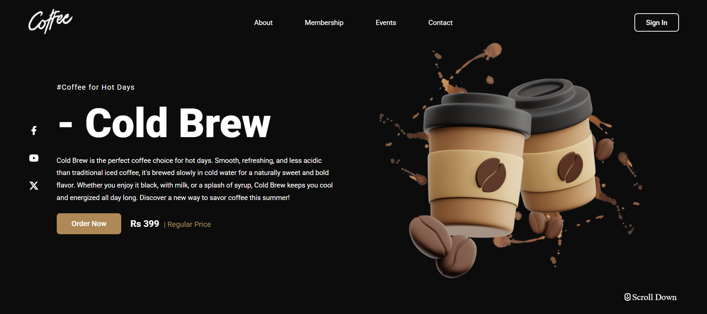

# **Landing Page - Cold Brew Coffee**
A Modern, Responsive Landing Page for promoting **Cold Brew Coffee** built with HTML, CSS and JavaScript.  
It features a Sleek Dark theme, Smooth typography and an attractive Coffee-themed Design to engage Customers.

## Features

- **Modern UI/UX** – Clean and Minimal Layout with a Dark Aesthetic.
  
- **Responsive Design** – Works perfectly on Desktops, Tablets and Mobile Devices.
  
- **Interactive Elements** – Order Button, Social Media Icons and Smooth Scroll Prompts.
  
- **Product Highlight** – Detailed Section describing Cold Brew’s Unique Benefits.
  
- **Price Display** – Shows promotional and Regular Prices Clearly.

## Tech Stack

- **HTML5** – For Semantic Structure.
- **CSS3** – For Styling and Animations.
- **JavaScript** – For Interactivity and User Engagement.

## Screenshots

Below is a Preview of **Landing Page - Cold Brew Coffee**, Showcasing the Layout and Styling Implemented Using pure HTML , CSS and Javascript. 
The Design focuses on Clean Structure, Responsiveness and Modern Styling.

